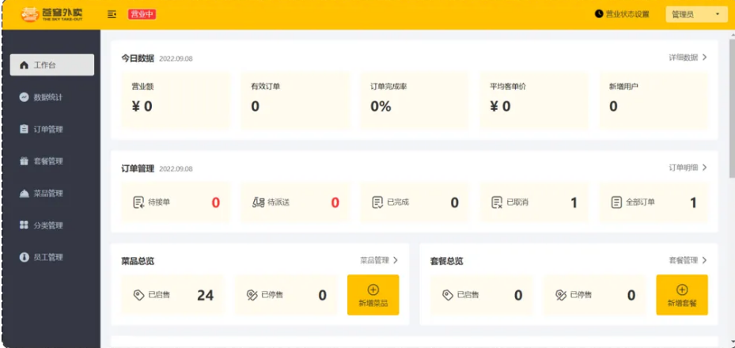
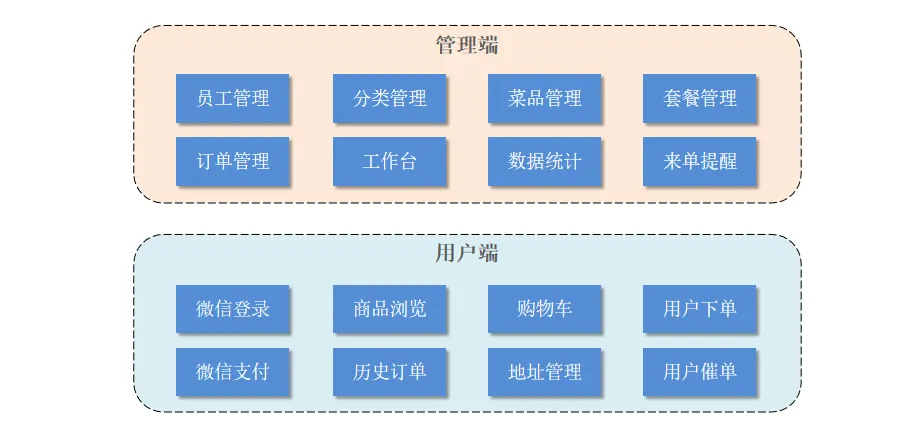
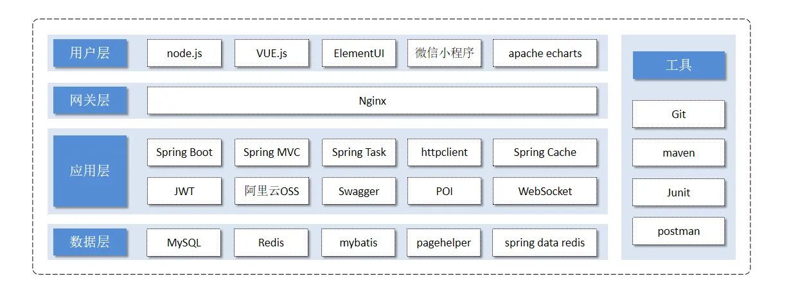
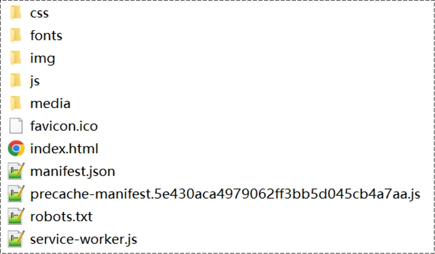
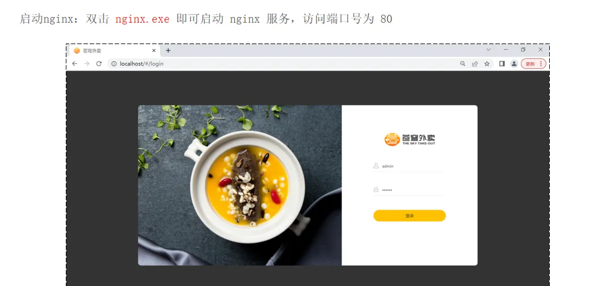
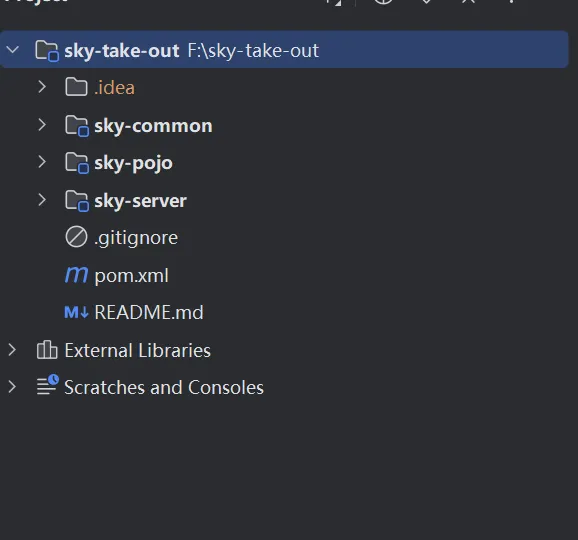

# -
SpringBoot+SSM的企业级Java项目实战《苍穹外卖》

#### 管理端

#### 用户端

#### 功能架构

#### 技术选型

#### 前端环境

#### 后端环境

###### sky-common 子模块中存放的是一些公共类，可以供其他模块使用

###### sky-pojo 子模块中存放的是一些 entity、DTO、VO

###### sky-server 子模块中存放的是 配置文件、配置类、拦截器、controller、service、mapper、启动类等
